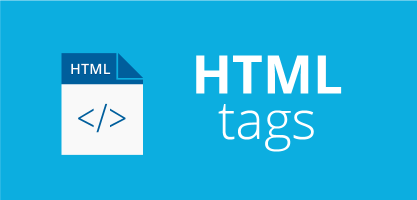

# HTML Tag Repository

Welcome to the HTML Tag Repository! This repository contains a collection of basic HTML tags that can be used to create web pages.

## Table of Contents
- [Introduction](#introduction)
- [Included Tags](#included-tags)
- [Usage](#usage)
- [Contributing](#contributing)
- [License](#license)

## Introduction
HTML (Hypertext Markup Language) is the standard language used to create web pages. This repository serves as a reference for beginners and developers looking to understand and use basic HTML tags effectively.

## Included Tags
The repository includes examples and explanations for the following HTML tags:
- `<html>`
- `<head>`
- `<title>`
- `<body>`
- `<h1>` to `<h6>`
- `
`
- `<a>`
- ``
- `<ul>`, `<ol>`, `<li>`
- `
`
- ``
- `<form>`, `<input>`, `<button>`, `<textarea>`

Feel free to explore each tag for detailed usage instructions and examples.

## Usage
You can clone this repository to your local machine to explore the examples and experiment with the HTML tags. Simply open the `index.html` file in your web browser to view the examples.

## Contributing
Contributions to this repository are welcome! If you have suggestions for additional HTML tags or improvements to existing examples, please feel free to open an issue or submit a pull request.

# Feel Free to Downlaod and Use🌳
